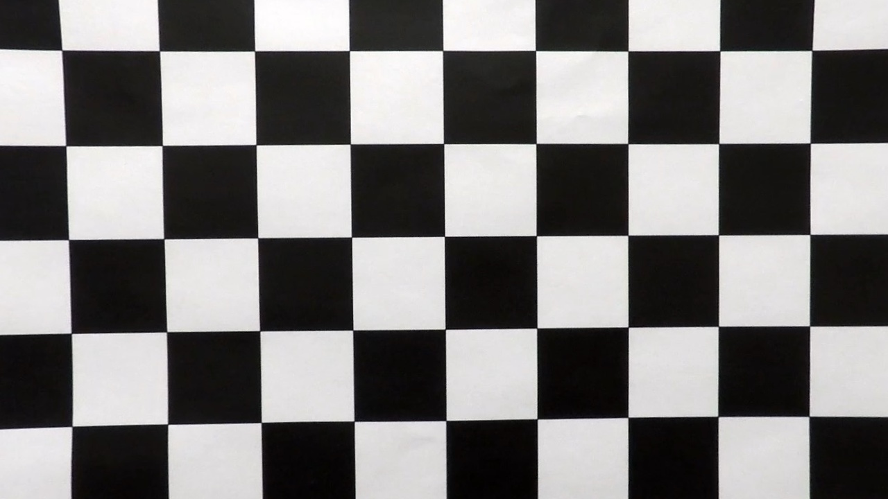

## Advanced Lane Finding

This project's goal is to code a software pipeline to identify the lane boundaries in a video. In order to do that, we tested different thresholds into the gradients, sobel and color channels with the different images provided by Udacity in the starter repo, once they have passed at the same time for a transformation process, regarding undistortion and warp (Eagle-eye perspective).

I delivered the expected rubric points as follow:

* Project Readme

* A jupyter notebook containing detailed steps followed to approach the solution.

    * **Camera calibration**: extract matrix and distortion coefficients. Provided distortion correction to raw images 
    
    

    * **Sobel, gradients and color transform** to create a thresholded binary image, obtained through the function helpers properly identified at the notebook. Conveniently displayed for each method, including the resulting conbination of the final pipeline.

    * **Perspective transformation** is also applied and tested *(Please refer to the writeup to see example)*

    * Method used to **identify lane line pixels** *(See notebook for detailed guide through)*

    * Determine radius of **curvature** of the lane and the position of the vehicle with respect to center.

    * **Warp** the detected lane boundaries back onto the original image.

    * Output **visual display** of the lane boundaries and numerical estimation of lane curvature and vehicle position. Resulting **pipeline application** to the road images, displaying successfully lane line recognition.

* Final 

* Project 

The images for camera calibration are stored in the folder called `camera_cal`.  The images in `test_images` are for testing your pipeline on single frames.  If you want to extract more test images from the videos, you can simply use an image writing method like `cv2.imwrite()`, i.e., you can read the video in frame by frame as usual, and for frames you want to save for later you can write to an image file.  

Saved examples of the output from each stage of the pipeline are in the folder called `output_images`, and include a description in your writeup for the project of what each image shows.    The video called `project_video.mp4` is in the folder `output_video`.  

For detailed guide through please refer to the project 